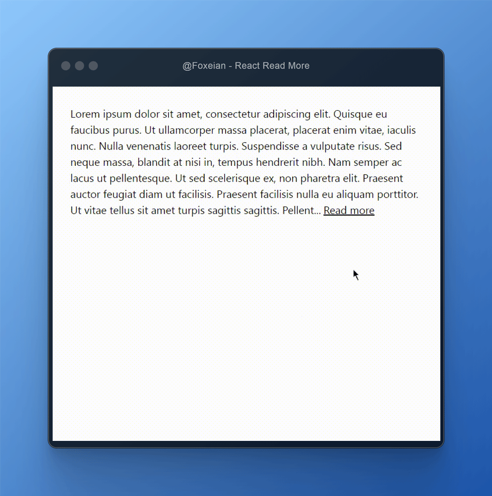

<p align="center">
  <a href="https://github.com/foxeian/react-read-more">
    <picture>
      
    </picture>
  </a>
</p>

# React Read More

<p align="center">
  <picture>
    
  </picture>
</p>

<p align="center">
  <a href="#quickstart">Quickstart</a> |
  <a href="#installation">Installation</a> |
  <a href="#example-of-readmorearea-customize">Examples</a> |
  <a href="#parameters">Parameters</a>  
</p>

## About

**React Read More** A React.js package for creating short text with a "read more" button to expand the text, built with TypeScript support. This package provides a simple and easy-to-use component for truncating and expanding text with a customizable button.

### Features

- Support Typescript
- Every part of component (container, text, button) is customizable
- It works with Server-side components (SSR)
- Support classes (Tailwind, Bootstrap, etc...)
- Easy-to-use

## Getting Started

### Installation

To install the package:

```bash
npm install @foxeian/react-read-more
```

### Quickstart

example of 'ReadMoreArea' in React Component

```tsx
import React from 'react';
import ReadMoreArea from '@foxeian/react-read-more';

export default function App() {
  return (
    <ReadMoreArea
      lettersLimit={100} // limit of letters (100 letters)
    >
      Lorem ipsum dolor sit amet, consectetur adipiscing elit, sed do eiusmod tempor incididunt ut labore et dolore magna aliqua.
    </ReadMoreArea>
  );
}
);
```

## Example of 'ReadMoreArea' customize

```tsx
import React from 'react';
import ReadMoreArea from '@foxeian/react-read-more';

const buttonStyle = {
  color: "blue",
  fontSize: "1rem",
  padding: "1.5rem",
  // Add any other CSS styles as needed
};

export default function App() {
  return (
    <ReadMoreArea
      className="flex flex-col" // classes styles of main div (tailwind)
      style={{ display: 'flex', flexDirection: 'column' }} // inline styles of main div
      expandLabel="Read more" // Expand Label
      collapseLabel="Read less" // Collapse Label
      textClassName="text-lg text-black" // classes styles of text (tailwind)
      textStyle={{ fontSize: '1rem', color: 'black' }} // inline styles of text
      buttonClassName="text-base text-green-700 p-6" // classes styles of button (tailwind)
      buttonStyle={buttonStyle} // inline styles of button
      lettersLimit={100} // limit of letters (100 letters)
    >
      Lorem ipsum dolor sit amet, consectetur adipiscing elit, sed do eiusmod tempor incididunt ut labore et dolore magna aliqua.
    </ReadMoreArea>
  );
}
);
```

### Parameters

| Name            | Description                | Type           | Default value |
| --------------- | :------------------------- | :------------- | :------------ |
| className       | classes styles of main div | string         | null          |
| style           | inline styles of main div  | CSS Properties | null          |
| expandLabel     | Expand Label               | number         | `Read more`   |
| collapseLabel   | Collapse Label             | string         | `Read less`   |
| textClassName   | classes styles of text     | string         | null          |
| textStyle       | inline styles of text      | CSS Properties | null          |
| buttonClassName | classes styles of button   | string         | null          |
| buttonStyle     | inline styles of button    | CSS Properties | null          |
| lettersLimit    | limit of letters           | number         | 500           |

## License

MIT © [Immanuel Ehsan](https://github.com/foxeian)
